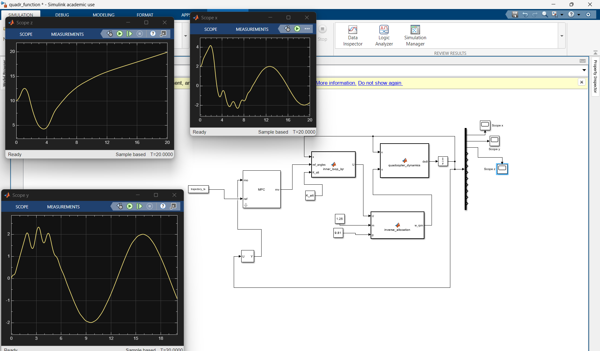

# Autonomous Quadcopter Trajectory Tracking & Attitude Control

This repository contains a full 6-DOF non-linear simulation of a quadcopter (based on DJI F450 parameters) tracking an aggressive 3D trajectory using a cascaded control architecture in MATLAB/Simulink.

## 🛠️ Control Architecture
* **Outer-Loop (Position):** Model Predictive Control (MPC) running at 20Hz. Translates 3D trajectory waypoints into optimal roll/pitch commands while strictly enforcing a 30-degree max tilt constraint.
* **Inner-Loop (Attitude):** Linear Quadratic Regulator (LQR) running at high frequency to stabilize roll, pitch, and yaw dynamics against aggressive optimal commands.
* **Plant:** Custom 6-DOF non-linear Newton-Euler equations of motion.
* **Mixer:** Inverse control allocator mapping analytical torques/forces to individual motor RPMs.

## 🚀 Features
* **Differential Flatness Trajectory:** Generates a continuously differentiable 3D helix path.
* **Robust Wind Rejection:** Actively detects and fights lateral wind disturbances (e.g., 4N step wind gusts) by pitching into the wind while maintaining altitude and path tracking.

## ⚙️ How to Run
1. Open the project in MATLAB.
2. Run `main_setup.m` to load physical parameters, calculate the LQR `K_att` matrix, initialize the `mpcobj`, and generate the reference trajectory timeseries.
3. Open `models/quadr_function.slx`.
4. Click **Run** in Simulink to simulate the 20-second flight.
5. Open the Scopes to view X, Y, Z tracking and disturbance recovery.

## 📊 Results

**3D Target Trajectory:**

**Baseline Tracking Performance (No Disturbances):**

**Wind Rejection Performance (4N Lateral Gust):**
_with_ext_factors_such_as_wind.png)
